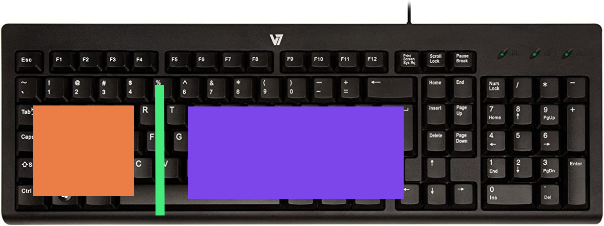
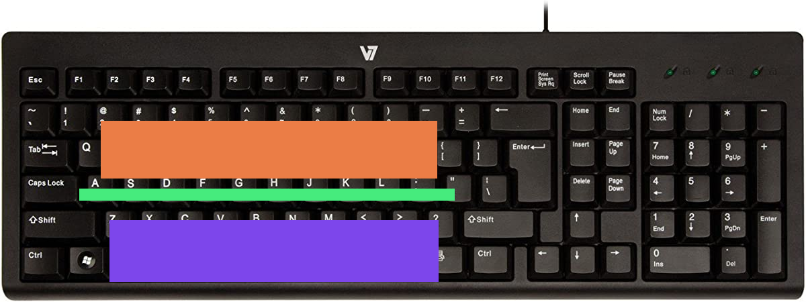

## Tmux basics

`tmux` can be used as a normal terminal emulator with persistence, although if you want to get more out of it there are a couple basic things you should know.

In tmux there is a key-combo called the `prefix` in the standard configuration (and in this configuration) the prefix is `Ctrl-b`. This config contains a few lines at the beginning that describe how to change the prefix to the keys of your liking, though I recommend using the default. 


For a more comprehensive list of important tmux commands [go here](https://tmuxcheatsheet.com/)

If you are a true beginner there are a few commands you should know focus on

## Manipulating panes 
```
PREFIX % # split window vertically
PREFIX " # split window horizontally
```

I've heard of people complaining that these hotkeys feel too arbitrary, here is my intuition. 



The `%` key splits the keyboard into the orange and purple regions, creating a vertical split. The same goes for the `"` key



Now that you can create panes, you will want to navigate between them. I almost exclusively use these hotkeys (if not the mouse)

```
PREFIX o # cycle between open panes
PREFIX CTRL-A # CUSTOM: same as above, but it's faster to hold CTRL and alternate between A and B
PREFIX ; # go to last pane
```

if all else fails, the mouse is enabled by default in this config, just click the pane you want

## Manipulating windows


```
PREFIX c # create a new window
PREFIX n # go to next window
PREFIX p # go to previous window
```

If for some reason you have too many windows to cycle

``` 
PREFIX w # open a menu to pick between all available windows
```


## Copy text

with `tmux-yank` and some config copied from [here](https://www.seanh.cc/2020/12/27/copy-and-paste-in-tmux/) just highlight some text, enter your copy hotkey, and that's it. One annoyance here is that you have to hold down the mouse button while copying since the highlight disappears after releasing the mouse button.

 I chose to not use the `tmux-yank` action `copy-pipe-no-clear` that prevents the highlight from disappearing due to buggy behaviour. Feel free to uncomment the line in the config to try it out.

## Plugins

This comes with these plugins

```
tpm # tmux plugin manager
tmux-sensible # a ton of 'sensible' defaults
tmux-resurrect # save tmux state including windows, pane configuration, and running programs; restore even after a hard shutdown
tmux-continuum # save every 15 minutes and restore using tmux-resurrect automatically
tmux-yank # easier copy and paste
```

